# Task Management System
## Academic Project Report

**Program:** Master of Science  
**Course Context:** Software Development / Full-Stack Systems Development  
**Project Type:** Team-Based Full-Stack Web Application  
**Project Title:** Task Management System  

---

## Abstract

This report presents the design, implementation, collaboration process, and deployment workflow of a team-based full-stack **Task Management System**. The system was developed to support task creation, task tracking, status updates, workspace-based collaboration, member participation, and discussion through task comments. The implementation combines a **Spring Boot** backend, a **React + TypeScript** frontend, a **PostgreSQL** database, **Docker**-based containerization, and **GitHub Actions** for CI/CD automation.

The development process followed a role-based team workflow. One member managed project coordination and GitHub integration, one developed the backend services and APIs, one implemented the frontend user experience, and one handled DevOps, Docker, and automation workflows. The project also included public-facing demo preparation through Netlify deployment for frontend presentation purposes.

This report documents the complete workflow from repository organization and feature planning to backend implementation, frontend integration, testing, containerization, CI/CD, deployment, and presentation readiness. Real project screenshots and repository artifacts are included to support the discussion.

---

## 1. Introduction

Modern software development increasingly depends on coordinated team workflows, version control discipline, modular system design, automated testing, and reliable deployment pipelines. In academic group projects, the final software artifact is only one measure of success; equally important is the ability to demonstrate a disciplined engineering workflow that reflects real industry practice.

The **Task Management System** was developed as a collaborative full-stack application to satisfy these requirements. The system enables users to:

- register and authenticate securely
- create and join workspaces
- manage tasks through CRUD operations
- assign priorities and statuses
- collaborate through comments
- filter and review task progress visually

In addition to implementing the application itself, the project emphasized:

- structured team collaboration
- branch-based Git workflows
- backend and frontend integration
- Docker-based reproducibility
- CI/CD automation
- demo-ready deployment

---

## 2. Project Objectives

The primary objectives of the project were:

1. To build a complete full-stack web application with meaningful collaborative functionality.
2. To divide development responsibilities across team members in a professional workflow.
3. To implement a backend API and a responsive frontend interface with persistent data storage.
4. To package the application using Docker for reproducible execution.
5. To configure CI/CD pipelines that automatically validate the project.
6. To prepare the application for public demonstration using a hosted frontend.

---

## 3. Team Structure and Role Distribution

The project followed a clear role-based team structure:

### Member 1: Project Manager + GitHub Maintainer

- created the GitHub repository
- managed branches
- merged code
- kept track of tasks
- prepared the final repository structure

### Member 2: Backend Developer

- created API routes
- connected the database
- implemented CRUD logic
- tested APIs

### Member 3: Frontend Developer

- created forms and user interface pages
- connected frontend with backend
- made the UI usable for demonstration

### Member 4: DevOps / Docker / CI-CD

- wrote the Dockerfile
- wrote docker-compose configuration
- set up GitHub Actions
- ensured the app builds automatically

---

## 4. Overall Development Workflow

The project workflow can be summarized in the following stages:

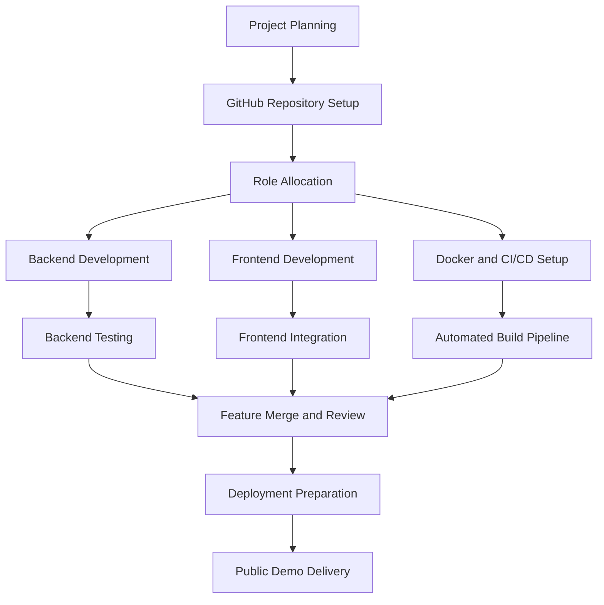

This workflow reflects a parallel but coordinated engineering approach in which members worked independently within their assigned responsibilities while maintaining a shared integration target.

---

## 5. GitHub and Repository Management Workflow

Version control was central to the team’s development process. The repository was structured to clearly separate backend, frontend, documentation, workflows, and deployment files.

### 5.1 Repository Organization

The main project root includes:

- `backend/`
- `frontend/`
- `.github/workflows/`
- `Dockerfile`
- `docker-compose.yml`
- `docs/`

### 5.2 Git Workflow

The project used Git-based collaboration principles:

- the main branch represented the stable project baseline
- feature work was developed independently
- changes were reviewed and integrated in a controlled manner
- repository structure was maintained carefully for submission readiness

### 5.3 Real Repository Evidence

#### Repository Root Structure

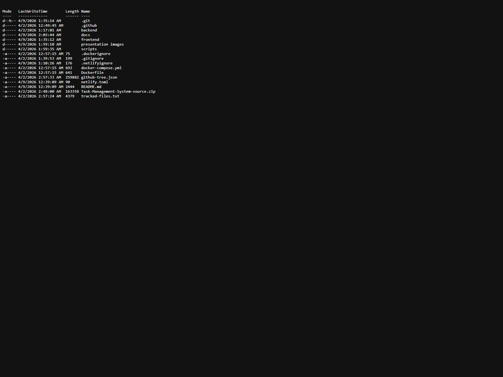

#### Git Status Evidence

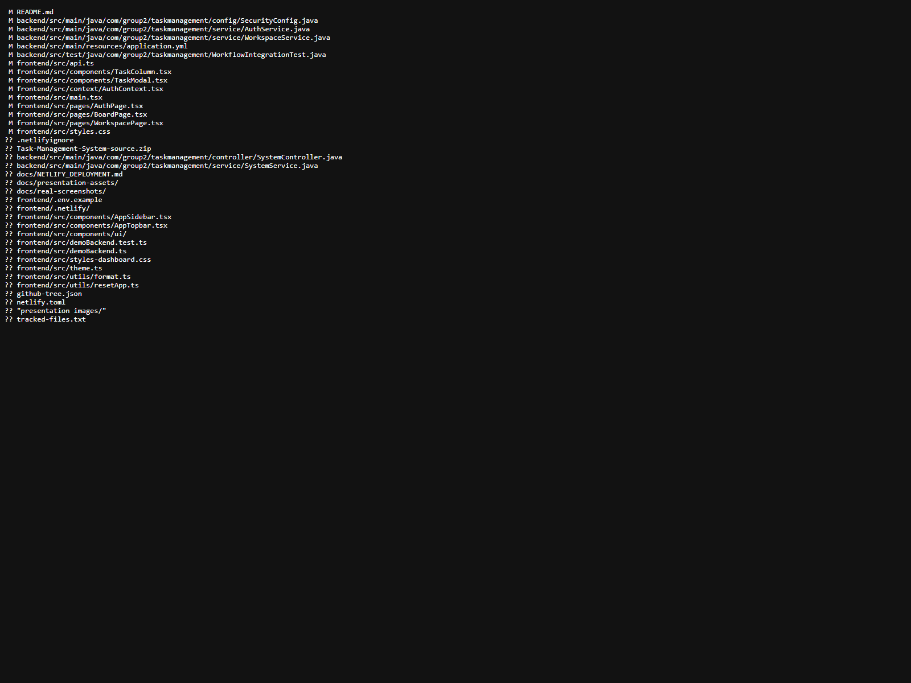

#### Git History Evidence

These screenshots show the real project state and support the repository coordination responsibilities performed by the project manager and GitHub maintainer.

---

## 6. Backend Development

The backend was developed using **Spring Boot 3**, **Java 21**, **Spring Security**, **Spring Data JPA**, **Flyway**, and **PostgreSQL**. Its main purpose was to manage authentication, workspaces, task operations, and team interaction through comments.

### 6.1 Backend Responsibilities

The backend developer completed the following major tasks:

- established the backend project architecture
- configured application properties
- connected PostgreSQL
- implemented controllers and service logic
- enforced security rules for protected APIs
- verified functionality through tests

### 6.2 API Design

The backend exposed a REST API for the following groups of operations:

#### Authentication

- `POST /api/auth/register`
- `POST /api/auth/login`
- `POST /api/auth/logout`
- `GET /api/auth/me`

#### Workspace Management

- `GET /api/workspaces`
- `POST /api/workspaces`
- `POST /api/workspaces/join`
- `GET /api/workspaces/{workspaceId}/members`

#### Task Management

- `GET /api/workspaces/{workspaceId}/tasks`
- `POST /api/workspaces/{workspaceId}/tasks`
- `PUT /api/tasks/{taskId}`
- `DELETE /api/tasks/{taskId}`

#### Comments

- `GET /api/tasks/{taskId}/comments`
- `POST /api/tasks/{taskId}/comments`

### 6.3 Backend Security

Spring Security was used to ensure that:

- public routes were limited to login and registration
- authenticated users could access protected API routes
- workspace and task operations were restricted by session-based authentication
- authorization checks prevented unauthorized workspace access

### 6.4 Backend Screenshots

#### Authentication Controller

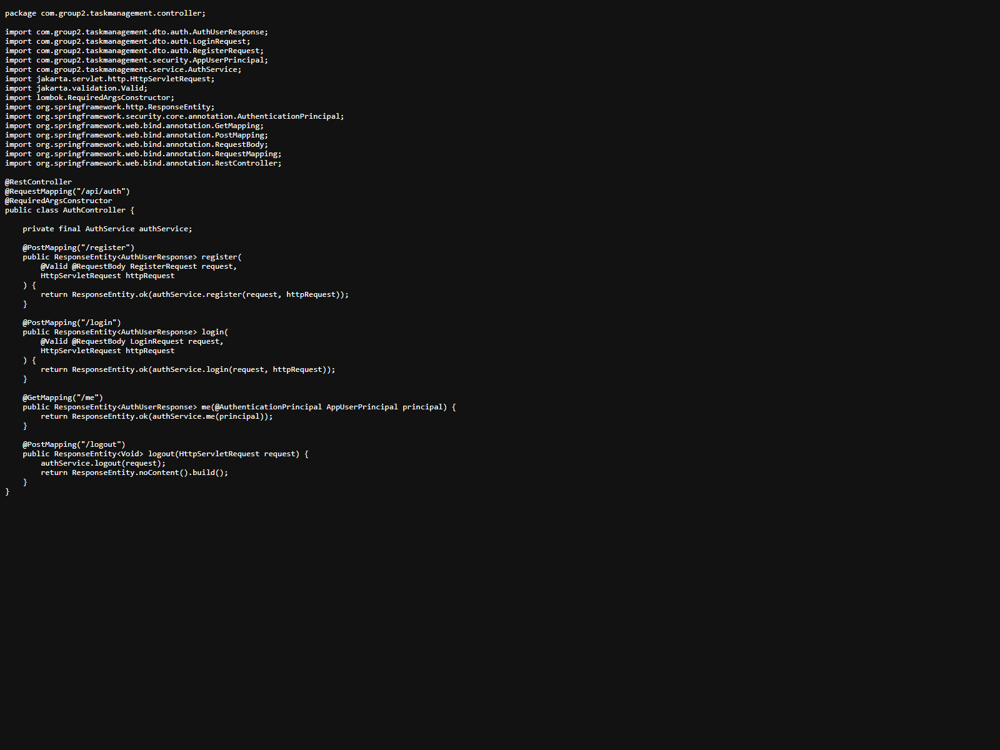

#### Workspace Controller

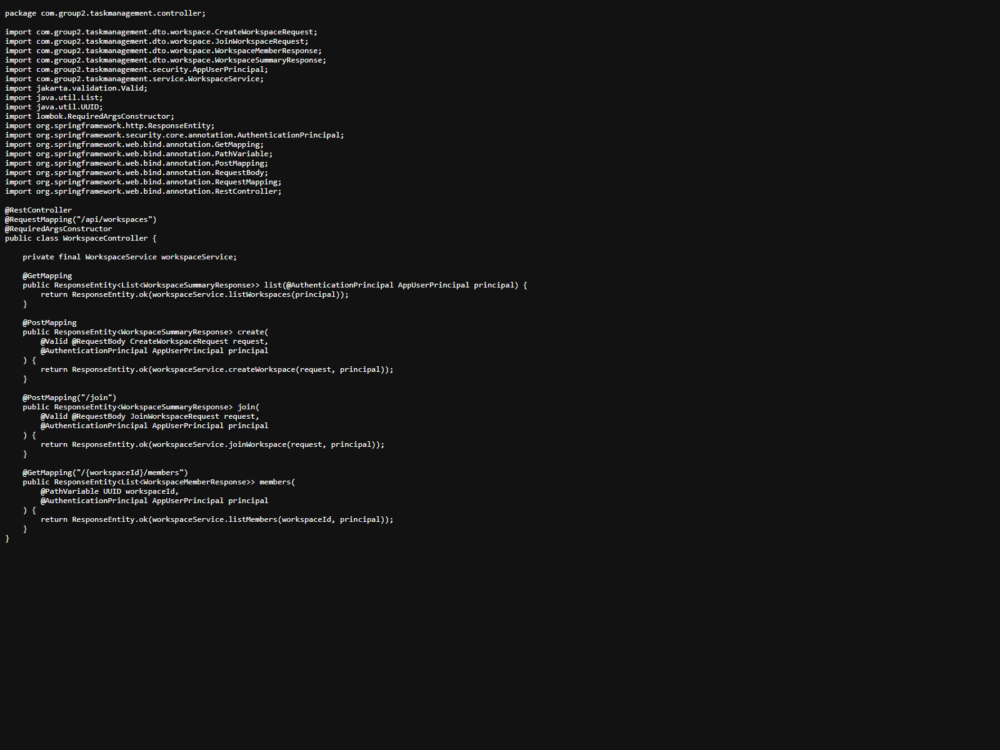

#### Task Controller

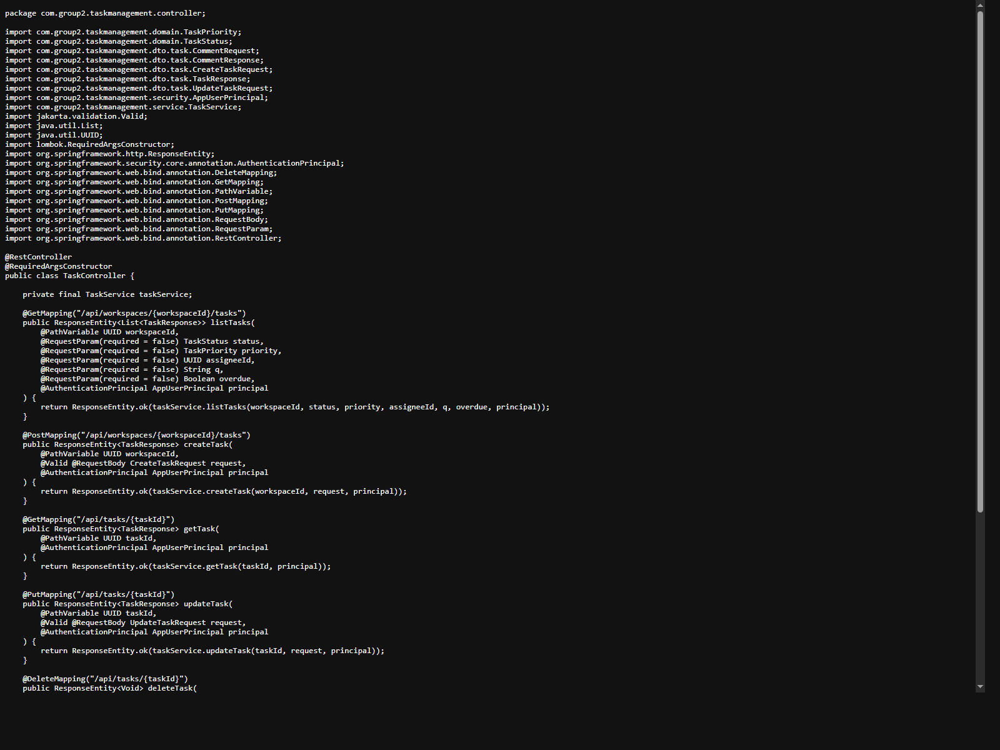

These controller screenshots provide direct evidence of the implemented backend routes and the logic organization of the service layer.

---

## 7. Database and Persistence Layer

The system uses **PostgreSQL** as the relational database. Data persistence was implemented using **Spring Data JPA**, while schema versioning support was included through **Flyway**.

### 7.1 Main Data Entities

The major data structures in the system include:

- User
- Workspace
- WorkspaceMember
- Task
- Comment

### 7.2 Persistence Responsibilities

The persistence layer supports:

- user registration and retrieval
- workspace ownership and membership
- task creation and assignment
- task status updates
- comment storage and retrieval

The database design reflects a collaborative workspace model rather than a single-user task list system, making it suitable for group-based project workflows.

---

## 8. Frontend Development

The frontend was developed using **React**, **TypeScript**, and **Vite**. It provides the user-facing interface for authentication, workspace management, task interaction, filtering, and visual demonstration.

### 8.1 Frontend Responsibilities

The frontend developer completed the following tasks:

- created authentication pages
- created the workspace management page
- created the task board page
- connected the UI to backend APIs
- improved usability for demonstration
- supported hosted demo behavior

### 8.2 Frontend Architecture

The frontend includes:

- route-based page structure
- reusable UI components
- centralized API access
- authentication context management
- task and workspace state rendering

### 8.3 Frontend Screenshots

#### Live Login Page

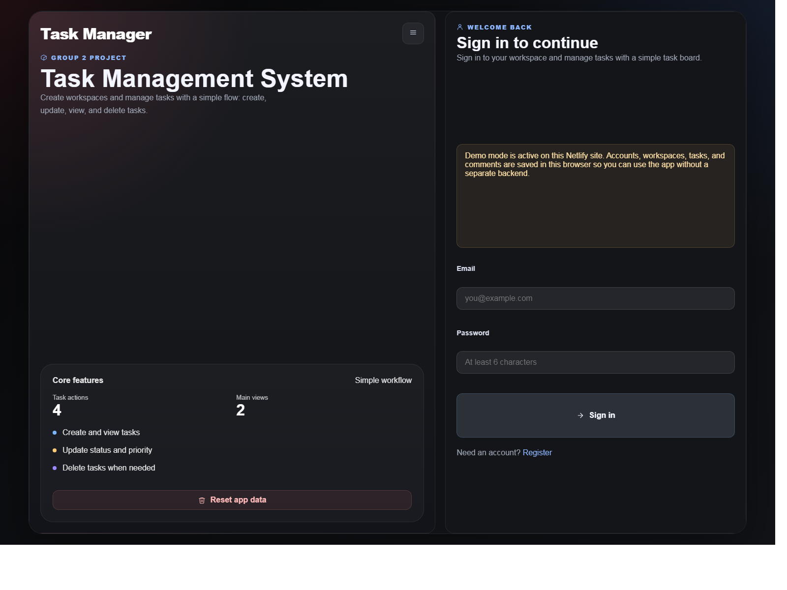

#### Live Registration Page

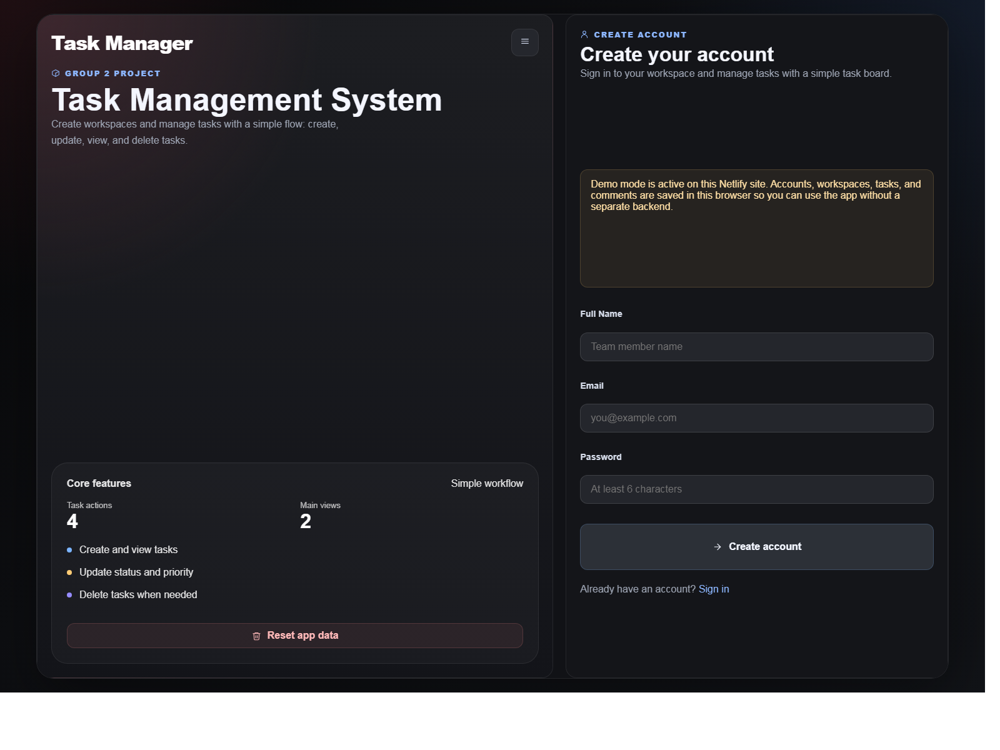

These screenshots were captured from the real deployed frontend and demonstrate the current user interface quality, visual organization, and presentation readiness.

---

## 9. Frontend-Backend Integration

A major stage of development involved integrating the frontend with the backend API. This ensured that the system moved beyond isolated modules and became a functioning full-stack application.

### 9.1 Integration Responsibilities

Integration included:

- login and session retrieval from the backend
- workspace listing and creation from frontend forms
- task creation and update from task board interactions
- comment submission and retrieval
- reset and demo-related support flows

### 9.2 Integration Outcomes

The result was a complete user flow:

1. user registers or logs in  
2. user accesses workspaces  
3. user creates or joins a workspace  
4. user creates and updates tasks  
5. user comments on tasks  
6. team members collaborate in the shared workspace

This stage transformed the application from a set of independent components into a coherent collaborative system.

---

## 10. Docker and Containerization

The project includes Docker-based packaging to ensure reproducible execution across machines and environments.

### 10.1 Dockerfile

The Dockerfile uses a **multi-stage build** approach:

1. frontend build stage
2. backend build stage
3. final runtime stage

This approach is efficient because it:

- separates build dependencies from runtime dependencies
- reduces the final image size
- integrates frontend static output into the backend package

#### Dockerfile Screenshot

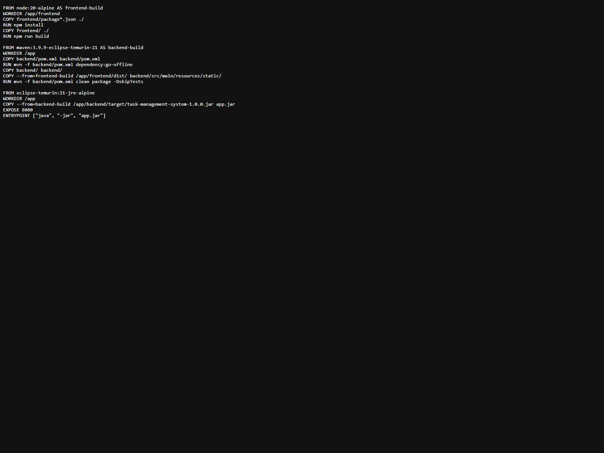

### 10.2 Docker Compose

Docker Compose was used to run:

- the PostgreSQL container
- the application container

This allows the team to start the system locally with a single command.

#### Docker Compose Screenshot

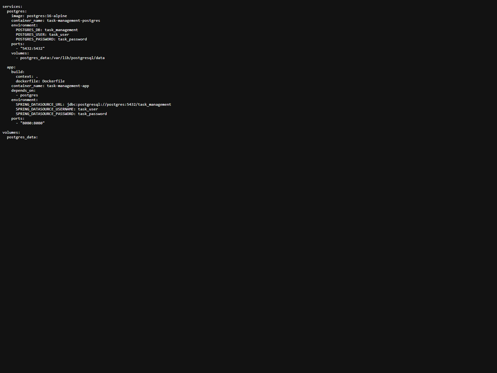

---

## 11. CI/CD and GitHub Actions

To improve software quality and reduce integration failure, the project includes automated CI/CD workflows using **GitHub Actions**.

### 11.1 CI Workflow

The continuous integration workflow performs the following steps:

- checks out the repository
- sets up Java 21
- sets up Node 20
- installs frontend dependencies
- runs frontend tests
- builds the frontend
- runs backend tests

#### CI Workflow Screenshot

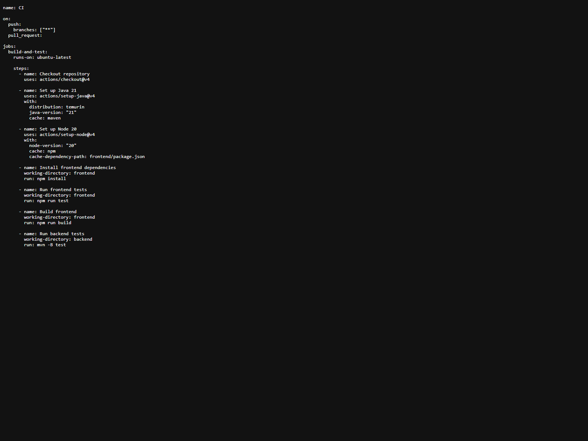

### 11.2 Docker Publish Workflow

The project also includes a Docker publishing workflow that:

- triggers on pushes to `main`
- builds the Docker image
- pushes the image to Docker Hub

#### Docker Publish Workflow Screenshot

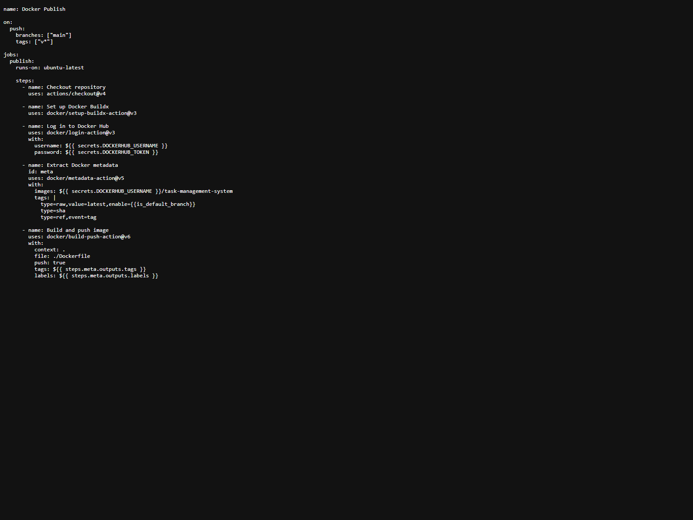

These workflows demonstrate that the project was developed with a professional engineering mindset rather than as a one-time manually executed prototype.

---

## 12. Testing and Validation

The project includes automated verification at both frontend and backend levels.

### 12.1 Backend Testing

Backend tests verify the system workflow for:

- registration
- workspace creation
- task creation
- task updates
- comment creation

### 12.2 Frontend Testing

Frontend testing validates important utility behaviors and core frontend logic.

### 12.3 Build Verification

The project was also verified through:

- frontend production build
- backend test execution
- CI workflow automation
- deployment readiness checks

---

## 13. Deployment and Public Demo Preparation

The frontend was prepared for hosted access using **Netlify**. Because the full backend requires a Java runtime and PostgreSQL, the frontend was treated as a public-facing demo layer while backend hosting remains a separate deployment concern.

### 13.1 Deployment Challenge

Initially, the hosted frontend produced an error because the backend was not publicly connected. This created a real-world deployment constraint:

- the frontend was available
- the backend was not yet publicly reachable
- authentication requests therefore failed in the hosted environment

### 13.2 Deployment Solution

To support academic demonstration and presentation, the frontend was adapted to support a browser-based demo mode when a public backend URL is unavailable. This ensured the hosted version remained usable for:

- account creation in demo mode
- workspace creation
- task management
- comments
- reset and repeated demo runs

This deployment adaptation improved the presentation value of the project while preserving the original backend architecture.

---

## 14. Challenges Encountered

The project involved several practical challenges typical of collaborative software engineering:

### 14.1 Integration Challenge

Coordinating frontend and backend changes required a stable contract between API responses and frontend expectations.

### 14.2 Deployment Challenge

The frontend hosting environment differed from the backend runtime requirements, requiring a separation between demo deployment and full production architecture.

### 14.3 Team Coordination Challenge

Because different members worked on separate areas, repository management and merge discipline were necessary to prevent conflicts and maintain project stability.

### 14.4 Build and Automation Challenge

The system required both Java and Node toolchains, which made CI/CD setup and Docker integration especially important.

---

## 15. Academic Reflection on Workflow

From a master’s-level perspective, this project demonstrates several important software engineering practices:

- modular system design
- role-based team collaboration
- layered backend architecture
- API-driven frontend integration
- reproducible deployment through Docker
- automated quality control through CI/CD
- practical adaptation to hosting constraints

The project therefore represents more than a simple CRUD application. It reflects the workflow of a realistic multi-developer software project in which planning, version control, testing, deployment, and presentation are integrated into the engineering process.

---

## 16. Conclusion

The Task Management System successfully achieved the core objectives of collaborative full-stack development. The team implemented a role-based workflow in which repository management, backend engineering, frontend implementation, and DevOps automation were distributed across clearly defined responsibilities.

The backend supports secure and structured collaboration features. The frontend provides an accessible and presentation-ready interface. Docker enables reproducibility, while GitHub Actions ensures automated validation of the project. Public demo preparation further increased the usability of the project in an academic presentation context.

Overall, the project demonstrates an effective combination of technical implementation, collaborative process management, and deployment-aware software engineering practice appropriate for master’s-level academic work.

---

## 17. Appendix: Key Real Screenshots Included

- repository root structure
- git status
- git log
- backend authentication controller
- backend workspace controller
- backend task controller
- live frontend login page
- live frontend registration page
- Dockerfile
- docker-compose configuration
- GitHub Actions CI workflow
- Docker publish workflow

