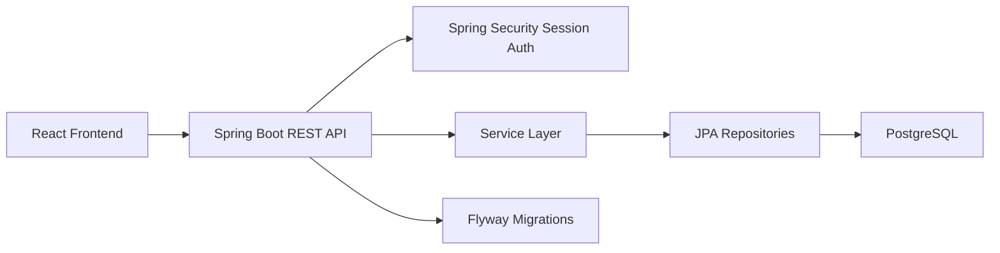

# Task Management System Documentation

## 1. Objective Mapping

This project satisfies the assignment objective by delivering a **simple CRUD-based web application** with:

- task creation
- task viewing
- task updating
- task deletion
- Docker containerization
- CI/CD implementation

The selected topic is **Group 2: Task Management System** from the provided course PDF.

## 2. Technical Requirements Alignment

### Backend

- Java 21
- Spring Boot 3
- Spring Security
- Spring Data JPA
- Flyway migrations

### Frontend

- React
- TypeScript
- Vite

### Database

- PostgreSQL

## 3. Functional Scope

### Authentication

- Register with name, email, and password
- Login and logout
- Session cookie authentication

### Workspace Collaboration

- Create a workspace
- Join a workspace using invite code
- View workspace members

### Task Management

- Create tasks
- View all tasks in Kanban format
- Update title, description, status, priority, due date, and assignee
- Delete tasks
- Filter by status, priority, assignee, overdue, and keyword

### Comments

- Add comments to tasks
- View task discussion history

## 4. Architecture Overview



## 5. Data Model

### User

- id
- name
- email
- passwordHash
- createdAt

### Workspace

- id
- name
- description
- inviteCode
- createdAt

### WorkspaceMember

- workspaceId
- userId
- role
- createdAt

### Task

- id
- workspaceId
- title
- description
- status
- priority
- dueDate
- assigneeId
- creatorId
- createdAt
- updatedAt

### Comment

- id
- taskId
- authorId
- body
- createdAt

## 6. REST API Summary

### Auth

- `POST /api/auth/register`
- `POST /api/auth/login`
- `POST /api/auth/logout`
- `GET /api/auth/me`

### Workspaces

- `GET /api/workspaces`
- `POST /api/workspaces`
- `POST /api/workspaces/join`
- `GET /api/workspaces/{id}/members`

### Tasks

- `GET /api/workspaces/{id}/tasks`
- `POST /api/workspaces/{id}/tasks`
- `GET /api/tasks/{id}`
- `PUT /api/tasks/{id}`
- `DELETE /api/tasks/{id}`

### Comments

- `GET /api/tasks/{id}/comments`
- `POST /api/tasks/{id}/comments`

## 7. Docker Requirement

This repository includes:

- a multi-stage [Dockerfile](../Dockerfile)
- a local development/demo [docker-compose.yml](../docker-compose.yml)

How to run:

```bash
docker compose up --build
```

## 8. CI/CD Requirement

This repository includes GitHub Actions workflows:

- [ci.yml](../.github/workflows/ci.yml)
- [docker-publish.yml](../.github/workflows/docker-publish.yml)

### CI pipeline

- install frontend dependencies
- run frontend tests
- build frontend
- run backend tests

### CD pipeline

- build Docker image from `main`
- publish image to Docker Hub

## 9. Test Coverage

### Backend

- workflow integration test for:
  - registration
  - workspace creation
  - task creation
  - task update
  - comment creation

### Frontend

- utility tests for task grouping and dashboard summary calculations

## 10. Submission Artifacts

### 1. GitHub Repository

- this repository contains the full source code and workflows

### 2. Documentation

- this file can be exported to PDF for submission

### 3. Docker Image or Instructions

- Dockerfile and Compose instructions are included
- Docker Hub publication workflow is included

## 11. Export to PDF

Recommended export methods:

1. Open this Markdown file in VS Code preview or GitHub.
2. Print to PDF.
3. Save the exported file as `Task_Management_System_Documentation.pdf`.

## 12. Presentation Demo Flow

1. Register a new user
2. Create a workspace
3. Copy the invite code
4. Create tasks with different statuses and priorities
5. Assign tasks to members
6. Add comments to a task
7. Show filters and overdue tasks
8. Show Docker and GitHub Actions workflow files
